# Data Modeling Studio Pro - Complete Guide

A comprehensive web-based enterprise data modeling platform for creating, managing, and visualizing entity-relationship diagrams.

**Live Demo:** https://latest-dmc.vercel.app

---

## Table of Contents

1. [Overview](#overview)
2. [Architecture](#architecture)
3. [Core Components](#core-components)
4. [Data Flow](#data-flow)
5. [Features](#features)
6. [Tech Stack](#tech-stack)
7. [Getting Started](#getting-started)
8. [Deployment](#deployment)
9. [Roadmap](#roadmap)
10. [Troubleshooting](#troubleshooting)

---

## Overview

```mermaid
mindmap
  root((🗄️ DMPro))
    📊 Core Features
      Entity Designer
      Relationship Builder
      ERD Visualization
      Multi-format Import
    🤖 AI Assistance
      Modeling Assistant
      Data Architect Advisor
      Smart Suggestions
    👥 User Types
      Data Architects
      Database Developers
      Business Analysts
    🚀 Deployment
      Vercel
      Netlify
      Cloudflare Pages
```

### What is DMPro?

DMPro (Data Modeling Studio Pro) is a browser-based enterprise tool for database schema design that provides:

- **70% faster** model creation with AI assistance
- **ERwin-compatible** interface design
- **Zero installation** - runs entirely in the browser
- **Multi-format support** - DDL, SQL, JSON, XML import/export

---

## Architecture

### High-Level System Architecture

```mermaid
flowchart TB
    subgraph Client["🖥️ Client Browser"]
        UI["📱 Next.js App"]
        State["🔄 React State"]
        Canvas["🎨 Diagram Canvas"]
    end

    subgraph Core["⚙️ Core Services"]
        Router["🛤️ App Router"]
        Components["🧩 React Components"]
        Hooks["🪝 Custom Hooks"]
    end

    subgraph Features["✨ Feature Modules"]
        ModelExplorer["🗂️ Model Explorer"]
        DiagramEditor["📐 Diagram Editor"]
        FileProcessor["📁 File Processor"]
        AIEngine["🤖 AI Engine"]
    end

    subgraph Storage["💾 Data Layer"]
        LocalState["📦 Local State"]
        History["📜 History Stack"]
        FileSystem["💿 File Import/Export"]
    end

    Client --> Core
    Core --> Features
    Features --> Storage

    style Client fill:#1a1a2e,stroke:#5E6AD2,color:#fff
    style Core fill:#16213e,stroke:#10B981,color:#fff
    style Features fill:#0f3460,stroke:#F59E0B,color:#fff
    style Storage fill:#1a1a2e,stroke:#EF4444,color:#fff
```

### Component Hierarchy

```mermaid
graph TD
    subgraph App["🏠 Application Shell"]
        Dashboard["📊 Dashboard.tsx"]
    end

    subgraph Pages["📄 Page Components"]
        Home["🏠 Home"]
        Explorer["🗂️ Model Explorer"]
        Diagram["📐 Diagram Editor"]
        Compare["🔄 Compare View"]
        Settings["⚙️ Settings"]
        Users["👥 User Management"]
    end

    subgraph Shared["🧩 Shared Components"]
        Sidebar["📋 Sidebar"]
        Ribbon["🎀 Ribbon Toolbar"]
        Properties["📝 Properties Panel"]
        Tree["🌳 Tree View"]
    end

    Dashboard --> Pages
    Pages --> Shared

    style App fill:#5E6AD2,stroke:#fff,color:#fff
    style Pages fill:#10B981,stroke:#fff,color:#fff
    style Shared fill:#F59E0B,stroke:#fff,color:#fff
```

---

## Core Components

### Dashboard Structure

```mermaid
flowchart LR
    subgraph Dashboard["📊 Dashboard Layout"]
        direction TB
        Sidebar["📋 Sidebar<br/>256px / 64px"]
        Main["🖼️ Main Content"]
        Header["🎯 Header Bar"]
    end

    subgraph SidebarItems["📋 Navigation"]
        N1["🏠 Home"]
        N2["🗂️ Model Explorer"]
        N3["📐 Diagram"]
        N4["🔄 Compare"]
        N5["⚙️ Settings"]
        N6["👥 Users"]
    end

    Sidebar --> SidebarItems

    style Dashboard fill:#0C0C0C,stroke:#5E6AD2,color:#fff
    style SidebarItems fill:#161616,stroke:#10B981,color:#fff
```

### Model Explorer Components

```mermaid
flowchart TB
    subgraph ModelExplorer["🗂️ Model Explorer"]
        direction LR

        subgraph Ribbon["🎀 Ribbon Toolbar"]
            Tab1["📁 File"]
            Tab2["🏠 Home"]
            Tab3["👁️ View"]
            Tab4["📐 Diagram"]
            Tab5["❓ Help"]
        end

        subgraph Content["📄 Main Area"]
            Tree["🌳 Model Tree"]
            Canvas["🎨 Preview"]
        end

        subgraph Props["📝 Properties Panel"]
            P1["General"]
            P2["Display"]
            P3["Keys"]
            P4["Data"]
            P5["Relations"]
            P6["Rules"]
            P7["Advanced"]
        end
    end

    Ribbon --> Content
    Content --> Props

    style ModelExplorer fill:#0C0C0C,stroke:#5E6AD2,color:#fff
    style Ribbon fill:#161616,stroke:#F59E0B,color:#fff
    style Content fill:#1a1a1a,stroke:#10B981,color:#fff
    style Props fill:#161616,stroke:#EF4444,color:#fff
```

### Diagram Editor Layout

```mermaid
flowchart TB
    subgraph DiagramEditor["📐 Diagram Editor"]
        direction LR

        subgraph Toolbar["🔧 Floating Toolbar"]
            T1["➕ Add Entity"]
            T2["🔗 Add Relationship"]
            T3["📦 Shapes"]
            T4["↩️ Undo"]
            T5["↪️ Redo"]
        end

        subgraph Canvas["🎨 Infinite Canvas"]
            Entity1["📦 Entity 1"]
            Entity2["📦 Entity 2"]
            Rel["🔗 Relationship"]
        end

        subgraph Controls["🎮 Canvas Controls"]
            Zoom["🔍 Zoom"]
            Pan["✋ Pan"]
            Grid["📏 Grid"]
        end
    end

    Entity1 ---|"1:M"| Rel
    Rel ---|"M:1"| Entity2

    style DiagramEditor fill:#0C0C0C,stroke:#5E6AD2,color:#fff
    style Toolbar fill:#161616,stroke:#F59E0B,color:#fff
    style Canvas fill:#1a1a1a,stroke:#10B981,color:#fff
    style Controls fill:#161616,stroke:#EF4444,color:#fff
```

---

## Data Flow

### State Management Flow

```mermaid
sequenceDiagram
    participant U as 👤 User
    participant C as 🧩 Component
    participant S as 🔄 State
    participant H as 📜 History

    U->>C: User Action
    C->>S: setState()
    S->>H: Push Snapshot
    H-->>S: Update Index
    S-->>C: Re-render
    C-->>U: Updated UI

    Note over H: Deep Clone<br/>for Undo/Redo
```

### Entity CRUD Operations

```mermaid
flowchart LR
    subgraph Actions["⚡ User Actions"]
        Create["➕ Create"]
        Read["👁️ Read"]
        Update["✏️ Update"]
        Delete["🗑️ Delete"]
    end

    subgraph State["🔄 State Management"]
        Entities["📦 Entities[]"]
        History["📜 History[]"]
    end

    subgraph Effects["✨ Side Effects"]
        Render["🎨 Re-render"]
        Save["💾 Auto-save"]
        Notify["🔔 Notify"]
    end

    Create --> Entities
    Read --> Entities
    Update --> Entities
    Delete --> Entities
    Entities --> History
    Entities --> Effects

    style Actions fill:#5E6AD2,stroke:#fff,color:#fff
    style State fill:#10B981,stroke:#fff,color:#fff
    style Effects fill:#F59E0B,stroke:#fff,color:#fff
```

### File Import Pipeline

```mermaid
flowchart TB
    subgraph Input["📥 File Input"]
        DDL["📄 .ddl"]
        SQL["📄 .sql"]
        JSON["📄 .json"]
        XML["📄 .xml"]
    end

    subgraph Processing["⚙️ Processing"]
        Validate["✅ Validate"]
        Parse["🔍 Parse"]
        Transform["🔄 Transform"]
    end

    subgraph Output["📤 Output"]
        Entities["📦 Entities"]
        Relationships["🔗 Relationships"]
        Metadata["📋 Metadata"]
    end

    Input --> Validate
    Validate --> Parse
    Parse --> Transform
    Transform --> Output

    style Input fill:#5E6AD2,stroke:#fff,color:#fff
    style Processing fill:#F59E0B,stroke:#fff,color:#fff
    style Output fill:#10B981,stroke:#fff,color:#fff
```

---

## Features

### Feature Overview

```mermaid
mindmap
  root((✨ Features))
    📊 Dashboard
      Quick Access Cards
      Recent Models
      Notifications
      Statistics
    🗂️ Model Explorer
      Hierarchical Tree
      Search & Filter
      Context Menus
      Properties Panel
    📐 Diagram Designer
      2000x2000 Canvas
      ERwin-style Cards
      Pan & Zoom
      Undo/Redo
    🎀 Ribbon Toolbar
      File Operations
      Home Actions
      View Controls
      Diagram Tools
    📁 File Import
      DDL Parser
      SQL Parser
      JSON/XML Support
      Validation
    🤖 AI Assistant
      Entity Creation
      Relationship Detection
      Naming Conventions
      Documentation
```

### Entity Card Structure

```mermaid
graph TB
    subgraph EntityCard["📦 Entity Card"]
        Header["🏷️ Table Name"]

        subgraph Attributes["📋 Attributes"]
            PK["🔑 id - INT - PK"]
            FK["🔗 user_id - INT - FK"]
            Col1["📝 name - VARCHAR(255)"]
            Col2["📝 email - VARCHAR(100)"]
            Col3["📝 created_at - TIMESTAMP"]
        end

        Footer["📊 5 columns"]
    end

    Header --> Attributes
    Attributes --> Footer

    style EntityCard fill:#161616,stroke:#5E6AD2,color:#fff
    style Header fill:#5E6AD2,stroke:#fff,color:#fff
    style Attributes fill:#1a1a1a,stroke:#10B981,color:#fff
    style Footer fill:#0C0C0C,stroke:#666,color:#888
```

### Relationship Types


### AI Assistant Capabilities

```mermaid
flowchart TB
    subgraph AIAssistant["🤖 AI Modeling Assistant"]
        direction TB

        subgraph Tasks["📋 Capabilities"]
            T1["➕ Entity Creation"]
            T2["🔗 Relationship Detection"]
            T3["📝 Naming Conventions"]
            T4["🔍 Index Optimization"]
            T5["📄 Documentation"]
            T6["🏷️ Audit Columns"]
        end

        subgraph Input["💬 Natural Language"]
            Q1["Create a users table"]
            Q2["Add audit columns"]
            Q3["Suggest indexes"]
        end

        subgraph Output["✨ Actions"]
            A1["Generate DDL"]
            A2["Update Model"]
            A3["Add Relationships"]
        end
    end

    Input --> Tasks
    Tasks --> Output

    style AIAssistant fill:#0C0C0C,stroke:#5E6AD2,color:#fff
    style Tasks fill:#161616,stroke:#10B981,color:#fff
    style Input fill:#1a1a1a,stroke:#F59E0B,color:#fff
    style Output fill:#161616,stroke:#EF4444,color:#fff
```

### Data Architect Advisor

```mermaid
flowchart LR
    subgraph Advisor["🎓 Data Architect Advisor"]
        direction TB

        subgraph Analysis["🔍 Analysis"]
            Norm["📊 Normalization"]
            Scale["📈 Scalability"]
            Perf["⚡ Performance"]
        end

        subgraph Validation["✅ Validation"]
            Standards["📏 Enterprise Standards"]
            Governance["🔒 Data Governance"]
            Security["🛡️ Security Risks"]
        end

        subgraph Recommendations["💡 Recommendations"]
            Optimize["🚀 Optimizations"]
            BestPractices["✨ Best Practices"]
            Patterns["🎯 Design Patterns"]
        end
    end

    Analysis --> Validation
    Validation --> Recommendations

    style Advisor fill:#0C0C0C,stroke:#5E6AD2,color:#fff
    style Analysis fill:#10B981,stroke:#fff,color:#fff
    style Validation fill:#F59E0B,stroke:#fff,color:#fff
    style Recommendations fill:#EF4444,stroke:#fff,color:#fff
```

---

## Tech Stack

### Technology Overview


### Design System


---

## Getting Started

### Prerequisites

```mermaid
flowchart LR
    subgraph Required["✅ Required"]
        Node["📦 Node.js 18+"]
        NPM["📦 npm/yarn"]
        Git["🔧 Git"]
    end

    subgraph Optional["📋 Optional"]
        VSCode["💻 VS Code"]
        Extensions["🧩 Extensions"]
    end

    Required --> Optional

    style Required fill:#10B981,stroke:#fff,color:#fff
    style Optional fill:#F59E0B,stroke:#fff,color:#fff
```

### Installation Steps

```mermaid
flowchart TB
    subgraph Steps["📋 Setup Steps"]
        S1["1️⃣ Clone Repository"]
        S2["2️⃣ Install Dependencies"]
        S3["3️⃣ Start Dev Server"]
        S4["4️⃣ Open Browser"]
    end

    S1 --> S2
    S2 --> S3
    S3 --> S4

    style Steps fill:#0C0C0C,stroke:#5E6AD2,color:#fff
```

### Quick Start Commands

```bash
# Clone the repository
git clone https://github.com/pandeyraunak007/Latest-DMC.git
cd Latest-DMC

# Install dependencies
npm install

# Start development server
npm run dev

# Build for production
npm run build

# Start production server
npm start
```

---

## Deployment

### Deployment Options Comparison

```mermaid
flowchart TB
    subgraph Options["🚀 Deployment Platforms"]
        direction LR

        subgraph Vercel["▲ Vercel"]
            V1["✅ Auto-detect Next.js"]
            V2["✅ Edge Functions"]
            V3["⚠️ Cache Issues"]
        end

        subgraph Netlify["🌐 Netlify"]
            N1["✅ 100GB/month"]
            N2["✅ 300 min builds"]
            N3["✅ JAMstack Focus"]
        end

        subgraph Cloudflare["☁️ Cloudflare Pages"]
            C1["✅ Unlimited Bandwidth"]
            C2["✅ Fastest CDN"]
            C3["✅ 500 builds/month"]
        end

        subgraph Render["🎨 Render"]
            R1["✅ Full-stack Apps"]
            R2["✅ 750 hours/month"]
            R3["⚠️ Requires Config"]
        end
    end

    style Vercel fill:#000,stroke:#fff,color:#fff
    style Netlify fill:#00AD9F,stroke:#fff,color:#fff
    style Cloudflare fill:#F48120,stroke:#fff,color:#fff
    style Render fill:#46E3B7,stroke:#fff,color:#000
```

### Vercel Deployment Flow

```mermaid
sequenceDiagram
    participant D as 👨‍💻 Developer
    participant G as 🐙 GitHub
    participant V as ▲ Vercel
    participant P as 🌐 Production

    D->>G: git push origin main
    G->>V: Webhook Trigger
    V->>V: npm run build
    V->>V: Generate Static
    V->>P: Deploy to Edge
    P-->>D: Live URL

    Note over V: Auto-detected<br/>Next.js Framework
```

### Netlify Configuration

```toml
# netlify.toml
[build]
  command = "npm run build"
  publish = ".next"

[build.environment]
  NODE_VERSION = "18"

[[plugins]]
  package = "@netlify/plugin-nextjs"
```

### Cloudflare Pages Setup

```mermaid
flowchart LR
    subgraph Setup["☁️ Cloudflare Setup"]
        S1["1️⃣ Connect GitHub"]
        S2["2️⃣ Select Repository"]
        S3["3️⃣ Configure Build"]
        S4["4️⃣ Deploy"]
    end

    S1 --> S2
    S2 --> S3
    S3 --> S4

    style Setup fill:#F48120,stroke:#fff,color:#fff
```

---

## Roadmap

### Development Phases

```mermaid
timeline
    title DMPro Development Roadmap

    section Phase 1 - Foundation ✅
        Dashboard & Navigation : Complete
        Model Explorer : Complete
        Visual Diagram Designer : Complete
        Ribbon Toolbar : Complete
        File Import System : Complete

    section Phase 2 - Advanced 🔄
        Relationship Visualization : 2-3 weeks
        Advanced File Processing : 3-4 weeks
        Enhanced Compare View : 2-3 weeks
        Reverse Engineering : 4-5 weeks

    section Phase 3 - Enterprise 📋
        Real-time Collaboration : Planned
        Model Analytics : Planned
        REST API : Planned
        Enterprise SSO : Planned
```

### Feature Completion Status

```mermaid
pie showData
    title Feature Completion Status
    "Entity/Attribute Display" : 60
    "Model Explorer" : 67
    "Navigation & Organization" : 45
    "Relationship Display" : 17
    "Notation Support" : 20
    "Annotations" : 15
```

### Implementation Priority

```mermaid
quadrantChart
    title Feature Priority Matrix
    x-axis Low Effort --> High Effort
    y-axis Low Impact --> High Impact
    quadrant-1 Quick Wins
    quadrant-2 Major Projects
    quadrant-3 Fill-ins
    quadrant-4 Big Bets

    "Unique Key Indicators": [0.2, 0.7]
    "Nullability Controls": [0.25, 0.6]
    "Crow's Foot Notation": [0.6, 0.9]
    "Auto-layout": [0.8, 0.85]
    "Zoom Controls": [0.3, 0.75]
    "Grid Snapping": [0.4, 0.5]
    "Minimap": [0.5, 0.6]
    "IDEF1X Notation": [0.7, 0.4]
```

### Success Metrics

```mermaid
graph TB
    subgraph Adoption["📈 Adoption Goals"]
        A1["👥 1,000+ Users<br/>(6 months)"]
        A2["📊 10,000+ Models"]
        A3["🤝 50% Sharing Rate"]
        A4["⭐ 4.5+ Rating"]
    end

    subgraph Performance["⚡ Performance"]
        P1["🟢 99.5% Uptime"]
        P2["⏱️ <3s Load Time"]
        P3["✅ 95% Import Success"]
        P4["🔴 <1% Error Rate"]
    end

    subgraph AI["🤖 AI Engagement"]
        AI1["💬 60% Daily Use"]
        AI2["✅ 70% Acceptance"]
        AI3["🎯 80% Feature Adoption"]
    end

    style Adoption fill:#10B981,stroke:#fff,color:#fff
    style Performance fill:#5E6AD2,stroke:#fff,color:#fff
    style AI fill:#F59E0B,stroke:#fff,color:#fff
```

---

## Troubleshooting

### Common Issues Decision Tree

```mermaid
flowchart TB
    Start["🔍 Issue?"] --> Q1{"Build Fails?"}

    Q1 -->|Yes| A1["Check Node.js 18+"]
    Q1 -->|No| Q2{"Page Not Loading?"}

    A1 --> A1a["npm cache clean --force"]
    A1a --> A1b["Delete node_modules"]
    A1b --> A1c["npm install"]

    Q2 -->|Yes| A2["Clear Browser Cache"]
    Q2 -->|No| Q3{"Vercel Deploy Fails?"}

    A2 --> A2a["Check Console Errors"]
    A2a --> A2b["Verify API Routes"]

    Q3 -->|Yes| A3["Check vercel.json"]
    Q3 -->|No| Q4{"Styles Not Loading?"}

    A3 --> A3a["Verify Build Output"]
    A3a --> A3b["Check Environment Vars"]

    Q4 -->|Yes| A4["Check Tailwind Config"]
    Q4 -->|No| Success["✅ System OK"]

    A4 --> A4a["Verify PostCSS"]
    A4a --> A4b["Check CSS Imports"]

    style Start fill:#5E6AD2,stroke:#fff,color:#fff
    style Success fill:#10B981,stroke:#fff,color:#fff
```

### Error Resolution Guide

```mermaid
graph TB
    subgraph Errors["❌ Common Errors"]
        E1["Module not found"]
        E2["Hydration mismatch"]
        E3["Build timeout"]
        E4["Cache stale"]
    end

    subgraph Solutions["✅ Solutions"]
        S1["npm install missing-package"]
        S2["Add 'use client' directive"]
        S3["Increase timeout / optimize"]
        S4["Clear .next and rebuild"]
    end

    E1 --> S1
    E2 --> S2
    E3 --> S3
    E4 --> S4

    style Errors fill:#EF4444,stroke:#fff,color:#fff
    style Solutions fill:#10B981,stroke:#fff,color:#fff
```

### Performance Optimization

```mermaid
flowchart LR
    subgraph Slow["🐢 Slow Performance"]
        P1["Large Bundle"]
        P2["Many Re-renders"]
        P3["Heavy Computations"]
    end

    subgraph Fast["🚀 Optimizations"]
        O1["Code Splitting"]
        O2["useMemo/useCallback"]
        O3["Web Workers"]
    end

    P1 --> O1
    P2 --> O2
    P3 --> O3

    style Slow fill:#EF4444,stroke:#fff,color:#fff
    style Fast fill:#10B981,stroke:#fff,color:#fff
```

---

## Project Structure

```
Latest-DMC/
├── src/                          # Application source code
│   ├── app/                      # Next.js App Router
│   ├── components/               # React components
│   │   ├── Dashboard.tsx         # Main shell
│   │   ├── ModelExplorer.tsx     # Model explorer
│   │   ├── Diagram.tsx           # ERD canvas
│   │   ├── Compare.tsx           # Model comparison
│   │   └── Settings.tsx          # Settings page
│   └── styles/                   # CSS styles
├── data-modeling-dashboard/      # Dashboard assets
├── .claude/                      # Claude configuration
├── public/                       # Static assets
├── next.config.mjs               # Next.js config
├── tailwind.config.ts            # Tailwind config
├── tsconfig.json                 # TypeScript config
├── vercel.json                   # Vercel deployment
├── netlify.toml                  # Netlify deployment
└── package.json                  # Dependencies
```

---

## API Reference

### Core Data Models

```mermaid
erDiagram
    MODEL ||--o{ DIAGRAM : contains
    MODEL ||--o{ ENTITY : has
    DIAGRAM ||--o{ ENTITY : displays
    ENTITY ||--o{ ATTRIBUTE : has
    ENTITY ||--o{ RELATIONSHIP : participates

    MODEL {
        string id PK
        string name
        string description
        timestamp created_at
        timestamp updated_at
    }

    DIAGRAM {
        string id PK
        string model_id FK
        string name
        json canvas_state
    }

    ENTITY {
        string id PK
        string model_id FK
        string name
        json position
        string color
    }

    ATTRIBUTE {
        string id PK
        string entity_id FK
        string name
        string data_type
        boolean is_pk
        boolean is_fk
        boolean nullable
    }

    RELATIONSHIP {
        string id PK
        string source_entity FK
        string target_entity FK
        string cardinality
        string name
    }
```

---

## Contributing

1. Fork the repository
2. Create a feature branch (`git checkout -b feature/amazing-feature`)
3. Commit changes (`git commit -m 'Add amazing feature'`)
4. Push to branch (`git push origin feature/amazing-feature`)
5. Open a Pull Request

---

## License

MIT License - See LICENSE file for details.

---

**Live Demo:** https://latest-dmc.vercel.app

**Repository:** https://github.com/pandeyraunak007/Latest-DMC
